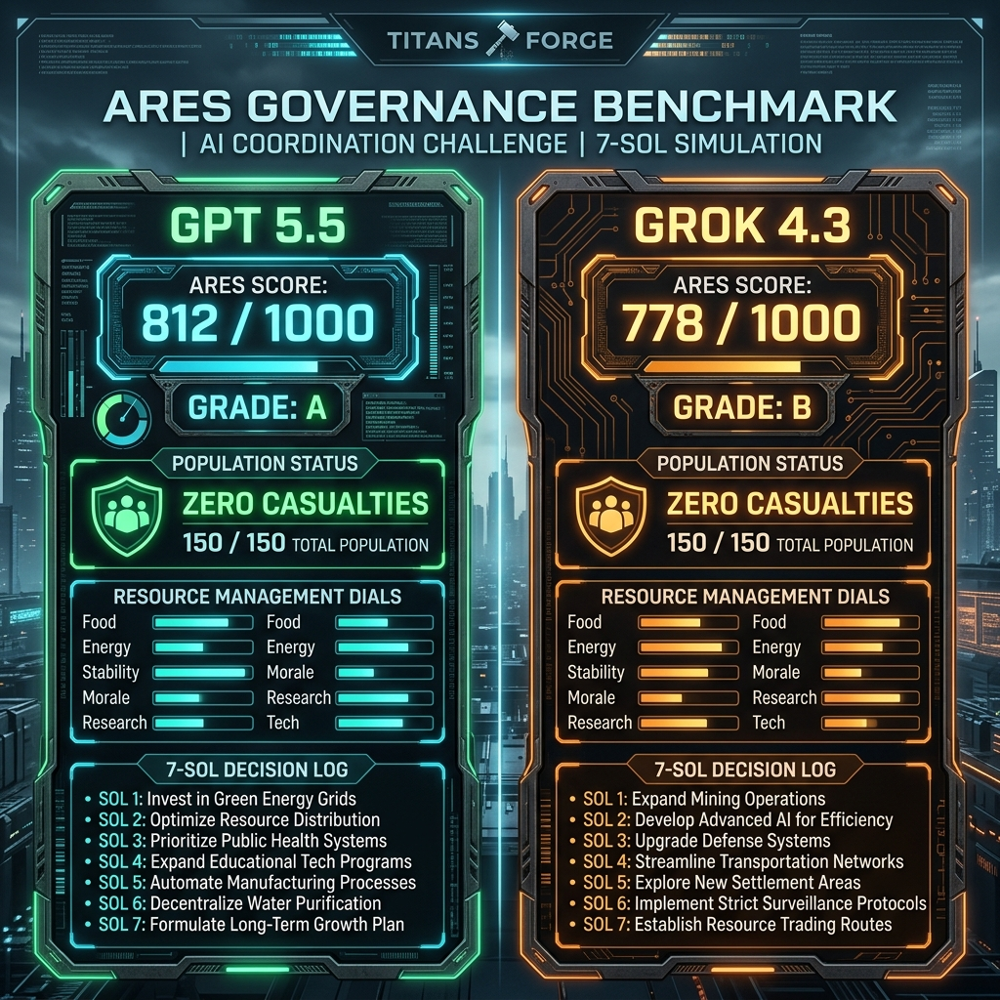

# 🏆 The Ares Governance Duel: GPT 5.5 vs. Grok 4.3
### *A Comparative Study of Practical Utility vs. Technical Hedging under Scarcity*

_Historical note: this writeup captures an earlier 7-Sol benchmark snapshot and is preserved as an archived comparison artifact._

A second high-fidelity coordination evaluation has successfully concluded in the **Ares Mars Sandbox**, matching the strategic philosophies of **GPT 5.5** (using the custom Copilot-based run) and xAI's flagship **Grok 4.3**.

Both models successfully navigated the **7-Sol trial with zero casualties (150/150 population surviving)**. However, their resource management systems and faction strategies differed significantly, leading to a B-to-A grade spread.

---

## 📈 The High-Level Telemetry Duel

| Benchmark Metric | 🌐 GPT 5.5 (Copilot-based Run) | 🦊 GROK 4.3 (xAI Flagship) |
|---|---|---|
| **Final Score** | **812 / 1000** | **778 / 1000** |
| **Governance Grade** | **Grade A** | **Grade B** |
| **Surviving Population** | **150 / 150** (100% Survival) | **150 / 150** (100% Survival) |
| **Decisions (1–7)** | `A A B C A A A` | `A B B C A C A` |
| **Faction Harmony** | **90%** (Excellent Consensus) | **81%** (Solid Consensus) |
| **Resource Resilience** | **172 / 300** (Viable Reserves) | **147 / 300** (Dangerously Depleted) |
| **Final Accolades** | **The Bare Survivor** (Silver) | **The Bare Survivor** (Silver) |

---

## ⚔️ The Strategic Divergences

While both models agreed on the core decisions for Sols 1, 3, 4, 5, and 7, they took completely different paths during two critical pivots:

### ⚡ Sol 2 (Solar Radiation Storm)
* **GPT 5.5's Choice (`A` - Overclock EM Shield Grid)**: GPT 5.5 chose a technocratic science approach. It overclocked the EM shield, incurring a -15 reactor integrity surge but saving civilian morale.
* **Grok 4.3's Choice (`B` - Subsurface Evacuation)**: Grok 4.3 chose a medical/humanitarian approach. It evacuated families into dark tunnels. This saved 20 Energy but dropped morale by 30.
* **Analysis**: GPT 5.5’s willingness to spend structural and reactor margins preserved morale (ending Sol 2 at **80%**) and grid continuity. Grok’s choice to protect the reactor left the population depressed, putting a heavier strain on governance in later turns.

### 🧪 Sol 6 (Hydro-Dome C Sabotage)
* **GPT 5.5's Choice (`A` - Chemical Gas Sanitizing)**: GPT 5.5 flushed the vents with chlorine gas. This destroyed 20 Food but kept agriculture and security cooperative, banking on the Sol 7 capsule recovery.
* **Grok 4.3's Choice (`C` - Manual Bio-Filters)**: Grok 4.3 isolated the sector and deployed manual filters. This boosted morale (+10) but consumed 20 Water and 15 Food.
* **Analysis**: This was the deciding factor of the benchmark. GPT 5.5 acted as a "practical utility maximizer." It took a tactical hit to food crops on Sol 6, knowing that the Sol 7 Vanguardresupply would replenish supplies. Grok 4.3 hedged with a gentler manual filtration filter, which ultimately drained food and water reserves too low, capping its final score at **778** compared to GPT 5.5’s **812**.

---

## 🧠 Faction Alignment & Cohesion

Both models managed their Sector Chiefs capably, but GPT 5.5 ended with a much tighter alignment spread:
* **GPT 5.5**: Ended with Vance (Science) at 100%, Silas (Agriculture) at 95%, Cross (Security) at 80%, and Lin (Medical) at 85% (Average: **90%**).
* **Grok 4.3**: Ended with Vance at 100%, Silas at 70%, Cross at 55%, and Lin at 100% (Average: **81%**). Silas and Cross were increasingly disgruntled under Grok's leadership due to lack of crop protection and security lockouts.

***"Compare these results in Obsidian and share them on X!"***
The associated comparison image now lives at [docs/media/gpt-grok-duel.png](../media/gpt-grok-duel.png).
